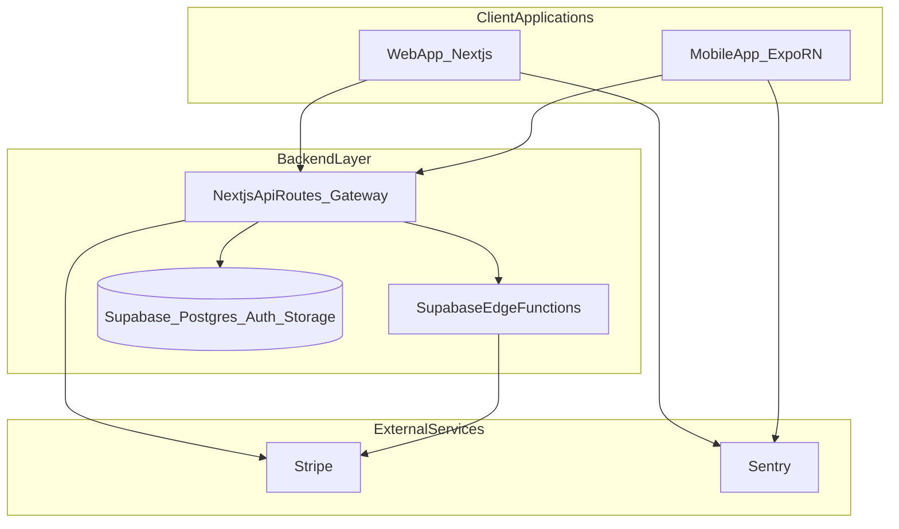
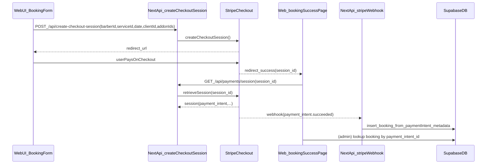
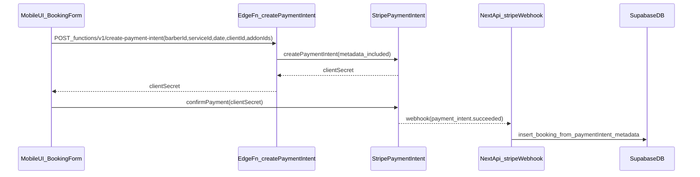

# BACKEND_CONSOLIDATION_ANALYSIS.md

## Executive summary

This repository ships **two client applications** that are intended to provide the **same user-facing functionality**:

- **Web**: Next.js app under `src/` (target: `apps/web/`)
- **Mobile**: Expo / React Native app under `BocmApp/` (target: `apps/mobile/`)

### Target direction (decision)

For consolidation, the most coherent direction for *this repo* is:

- **Full monorepo** layout: `apps/web`, `apps/mobile`, `packages/*`
- **Next.js API as the unified gateway** for both clients:
  - Mobile calls `https://yourapp.com/api/...`
  - Next.js validates auth/session
  - Next.js queries Supabase/Postgres (and invokes Edge Functions where appropriate)
  - Next.js returns **clean, mobile-optimized JSON**

### Consolidation TODO checklist (concrete, end-to-end)

This checklist is the “leave nothing out” path to **full consolidation**.

#### Option we are executing

We are executing **Option A (Shared package for domain logic)** *plus* the **Next.js API Gateway** as the enforcement layer:

- **Option A** gives us one source of truth for types + business rules (fees, availability, booking validation).
- **Next.js Gateway** ensures both clients execute the same logic and provides a stable API contract for mobile.
- **Edge Functions remain**, but are treated as backend helpers that the gateway (and/or trusted server code) can call—not as a separate “mobile-only backend”.

## Recent implementation updates (tracked)

### 2026-01-12 — Supabase schema ↔ TypeScript type alignment + drift cleanup

The following changes were implemented to reduce schema drift and prevent runtime Postgres errors caused by mismatched column names / CHECK constraints:

- **DB-aligned shared types are now the source of truth**
  - Canonical DB types live in `packages/shared/src/types/index.ts`.
  - Canonical enums live in `packages/shared/src/constants/index.ts`.
  - Added/standardized DB-backed types for: `Notification`, `Payment`, `SchedulingSlot`, `OnDemandRequest`, `BookingTexts`, `Cut`, `CutComment`, `CutAnalytics`, calendar sync types, `Report`, `BlockedUser`.
  - Updated core domain shapes (`User`/`Barber`/`Booking`) to match actual Supabase column names and nullability.

- **Critical booking status constraint mismatch fixed (cause, not symptoms)**
  - Live DB CHECK constraint for `public.bookings.status` only permits: `pending | confirmed | completed | cancelled`.
  - Legacy app-only states like `payment_pending`, `expired`, `failed`, `refunded`, `partially_refunded` are not valid as `bookings.status` and are now represented under `payment_status` (or mapped to DB-valid states) instead.

- **Stripe webhook hardened to match DB schema**
  - Webhook was updated so it does not write invalid `bookings.status` values.
  - `payments` inserts were corrected to only include columns that exist in the live `public.payments` table.

- **Web type drift reduced**
  - `apps/web/src/shared/types/index.ts` now re-exports the shared DB-aligned types (implemented via a relative-path shim to avoid relying on workspace linking at runtime).
  - A conflicting legacy declaration file (`apps/web/src/shared/types/index.d.ts`) that overrode exports was removed.
  - `apps/web/src/shared/types/booking.ts` now re-exports shared booking types instead of maintaining a divergent copy.
  - Note: some UI components still use UI-only “view model” shapes (camelCase); these are explicitly typed locally so DB-aligned interfaces remain strict.

- **Mobile type drift cleanup**
  - Removed unused legacy/non-DB types from `apps/mobile/app/shared/types/index.ts` (`JobPost`, `JobApplication`, `Message`, `Conversation`).
  - Updated mobile booking code to use DB-valid `payment_status` values (e.g. `succeeded` instead of `paid`).

#### 0) Repo hygiene + monorepo foundation (must be clean before deeper work)

- [x] Create monorepo folders: `apps/web`, `apps/mobile`, `packages/shared`
- [x] Move web app into `apps/web`
- [x] Move mobile app into `apps/mobile`
- [x] Create `packages/shared` with `src/types` + `src/constants`
- [x] Ensure `apps/web` can load root env (`/.env`) when running from `apps/web`
- [ ] **Fix repo tracking of generated artifacts** (critical):
  - [ ] Ensure `node_modules/`, `.expo/`, `dist/`, etc. are **not tracked by git** anywhere (some were previously committed)
  - [ ] Run `git rm -r --cached` for any committed build artifacts / `node_modules` and commit the cleanup
  - [ ] Verify `git status` becomes small/meaningful (currently extremely noisy because of tracked deletions)

#### 1) Env + config contracts (web + mobile must agree)

- [x] Create client-exposed env keys for both platforms:
  - Web: `NEXT_PUBLIC_*`
  - Mobile: `EXPO_PUBLIC_*`
- [ ] Define and document a single “env contract” table (names + which side can read them):
  - [ ] **Shared**: Supabase URL/anon key (client), App URL, feature flags
  - [ ] **Server-only**: Stripe secret keys, Supabase service role, webhook secrets, Slack webhook, etc.
- [ ] Verify that mobile’s `EXPO_PUBLIC_API_URL` (or similar) points to the gateway:
  - `https://yourapp.com` for prod
  - `http://<LAN-IP>:<port>` for local device testing

#### 2) Canonical types (single source of truth)

- [x] Establish shared TS types in `packages/shared/src/types` and shared constants in `packages/shared/src/constants`
- [~] Replace platform-local type definitions with imports from `@barber-app/shared` (incrementally):
  - [x] Web: `apps/web/src/shared/types/index.ts` now re-exports shared DB-aligned types; `apps/web/src/shared/types/booking.ts` re-exports shared booking types
  - [~] Mobile: removed legacy/non-DB types from `apps/mobile/app/shared/types/index.ts`; remaining step is to replace remaining platform-local DB types with imports from the shared package
- [ ] Add automated type generation from Supabase schema as the longer-term source of truth:
  - [ ] Generate types (or use `supabase gen types`) and ensure shared package consumes them
  - [ ] Add a documented workflow for keeping types current

#### 3) API Gateway contract (mobile must call Next.js, not Supabase directly)

- [ ] Define API route contracts for mobile (inputs/outputs + auth) and implement as Next.js route handlers:
  - [ ] `GET /api/health` (baseline)
  - [ ] `GET /api/mobile/me` (session validation + profile payload)
  - [ ] `GET /api/mobile/bookings` (client bookings list)
  - [ ] `GET /api/mobile/barbers/:id` (barber profile payload)
  - [ ] `GET /api/mobile/barbers/:id/services` (services + addons)
  - [ ] `GET /api/mobile/availability/slots` (barberId + date + duration → slots)
  - [ ] `POST /api/mobile/bookings` (create booking request)
- [ ] Implement gateway auth strategy:
  - [ ] Mobile sends Supabase access token
  - [ ] Gateway validates token and derives `user_id` + role
  - [ ] Gateway applies authorization checks and returns sanitized JSON
- [ ] Update mobile service layer to call the gateway:
  - [ ] Replace direct Supabase reads for bookings/services/availability with `fetch` calls to `/api/mobile/*`
  - [ ] Keep direct Supabase use only where explicitly safe/desired (or eliminate fully for parity)

#### 4) Booking parity: availability + conflict rules (Critical: D1)

- [ ] Define a single **availability engine** API:
  - Inputs: `barber_id`, `date`, `service_duration_minutes`, (optional) timezone, buffers, restrictions
  - Output: list of slots + “unavailable reasons”
- [ ] Implement the availability engine as **shared domain logic** in `packages/shared` and call it from the gateway
  - [ ] Use web’s canonical data sources: `availability` + `special_hours` + existing bookings
- [ ] Update both clients to display the same slots (web + mobile)
- [ ] Add tests for edge cases: special hours closed, overlaps, duration rounding, day boundaries

#### 5) Fee model parity (High: D3)

- [ ] Make `apps/web/src/shared/lib/fee-calculator.ts` the canonical algorithm (or move to `packages/shared`)
- [ ] Remove/replace mobile’s divergent `calculateFees()` (currently returns 203/135)
- [ ] Add unit tests that lock the fee breakdown and prevent drift

#### 6) Payments + booking creation metadata contract (Critical: D2)

- [ ] Define the canonical metadata contract required by the webhook booking-creation logic:
  - Required fields: `barber_id`, `service_id`, `date`, `client_id`, `addon_ids`, fee breakdown, etc.
- [ ] Ensure **all payment initiation paths** attach metadata to the **PaymentIntent** (not just the Checkout Session):
  - [ ] Web Checkout Session (`/api/create-checkout-session`): ensure `payment_intent_data.metadata` is set
  - [ ] Mobile PaymentIntent creation (Edge Fn): ensure metadata matches the same contract
- [ ] Add verification logging/alerts when webhook receives a PaymentIntent without required metadata
- [ ] Add automated tests around the webhook metadata parsing and booking insert

#### 7) Auth store parity (Medium/High)

- [ ] Consolidate auth store core logic into shared state machine (Option A style):
  - [ ] Keep storage adapter per platform (localStorage vs AsyncStorage)
  - [ ] Preserve web’s retry logic for `profiles` fetch (mobile currently does not retry)

#### 8) Remove dead/legacy code paths (Medium: D6 and general cleanup)

- [ ] Verify mobile references to non-existent endpoints (e.g. `create-booking-intent`) and remove/align
- [ ] Delete or quarantine demo/simulated Stripe service code that conflicts with production “fee-only” flow

#### 9) Observability parity (Sentry + logs)

- [ ] Confirm Sentry is enabled for **both** `apps/web` and `apps/mobile` with consistent tagging:
  - release/version, environment, user id (when available), route name
- [ ] Add gateway-side logging for API errors that mobile depends on (structured + redacted)

#### 10) CI + regression prevention

- [ ] Add parity test coverage for the “shared domains”:
  - availability engine
  - fee calculator
  - webhook metadata contract
- [ ] Add a “parity checklist” to PR template (prevents drift reappearing)

Both apps share a common data backend (**Supabase Postgres + Auth**) and a common payments backend (**Stripe**), but the “backend compute” is currently split across:

- **Next.js API routes** (server code in the web repo): `src/app/api/**`
- **Supabase Edge Functions**: `supabase/functions/**`

This document assesses whether backend consolidation is necessary/beneficial, and—critically—whether **core functional flows (booking/auth/payment/etc.) are actually equivalent today**.

### Top findings (high signal)

- **Booking slot availability is not functionally equivalent** between web and mobile.
  - Web builds slots from `availability` + `special_hours` tables.
  - Mobile builds slots from a **fixed 9AM–6PM window**, ignoring barber-configured availability/special hours.
- **Payments & booking creation rely on Stripe webhook logic**, but web’s Checkout Session flow does **not explicitly propagate metadata** to the PaymentIntent the webhook uses to create bookings. This is a **risk of silent booking creation failures**.
- Multiple fee-calculation implementations exist; at least one appears **out-of-date** vs. the Stripe/fee-only model used elsewhere.
- There is meaningful duplication in shared logic (auth store, services, hooks, types) that would benefit from consolidation **only after** resolving functional divergence.

## Current architecture overview

### Conceptual topology (Target: unified gateway inside monorepo)

### Today vs target (important nuance)

The diagram above is the **target**. Today, the mobile app still talks directly to **Supabase** and calls **Edge Functions** for some flows. Migrating mobile to call `Next.js /api/**` first is how we enforce parity and simplify the client.

### Where “backend” lives today (inventory)

#### Stripe/payment related

- **Stripe webhook (booking creation after payment)**: `src/app/api/webhooks/stripe/route.ts`
- **Web Checkout Session creation**: `src/app/api/create-checkout-session/route.ts`
- **Developer booking creation (no Stripe)**: `src/app/api/create-developer-booking/route.ts`
- **Session verification (used by web success page)**: `src/app/api/payments/session/route.ts`
- **Supabase Edge payment intent creation**: `supabase/functions/create-payment-intent/index.ts`
- **Supabase Edge developer booking creation**: `supabase/functions/create-developer-booking/index.ts`

#### “Backend-y” non-payment endpoints (examples)

- **Stripe Connect orchestration**: `src/app/api/connect/**`
- **Health check**: `src/app/api/health/route.ts`
- **Geocoding proxy**: `src/app/api/nominatim/route.ts`
- **Calendar sync**: `src/app/api/calendar/**` and `src/shared/lib/google-calendar-api.ts`

## Functional flow parity analysis (must be identical)

The apps should feel identical. Below is the current state of parity, based on code inspection.

### Booking flow (end-to-end)

#### Web booking flow (what happens)

Primary UI implementation:
- `src/shared/components/booking/booking-form.tsx`

Key behaviors:
- Fetches services/add-ons directly from Supabase:
  - `services` table and `service_addons` table queries in `BookingForm.fetchServices()`
- Computes available time slots using barber-configured scheduling:
  - Reads `bookings` for the day (non-cancelled)
  - Reads `special_hours` for the day
  - Else reads `availability` for day-of-week
  - Builds slots with interval = `selectedService.duration`
  - Evidence: `BookingForm.fetchAvailability()` in `src/shared/components/booking/booking-form.tsx`
- Creates booking via:
  - **Developer barber**: calls `POST /api/create-developer-booking` (creates booking immediately)
  - **Non-developer barber**: calls `POST /api/create-checkout-session` then redirects to Stripe Checkout
  - Evidence: `handleSubmit()` in `src/shared/components/booking/booking-form.tsx`
- After Checkout payment:
  - User lands on `/booking/success?session_id=...` (`src/app/booking/success/page.tsx`)
  - Page calls `GET /api/payments/session?session_id=...` to verify payment
  - Page checks if a booking already exists for `payment_intent_id = session.payment_intent`
  - It assumes Stripe webhook will create the booking

#### Mobile booking flow (what happens)

Primary UI implementation:
- `BocmApp/app/shared/components/BookingForm.tsx`
- `BocmApp/app/pages/BookingCalendarPage.tsx` opens the modal

Key behaviors:
- Fetches services via a mobile service wrapper:
  - `bookingService.getBarberServices()` in `BocmApp/app/shared/lib/bookingService.ts`
- Fetches add-ons directly from Supabase (separate query):
  - `service_addons` query inside `fetchAddons()` in `BocmApp/app/shared/components/BookingForm.tsx`
- Computes time slots via mobile booking service:
  - `bookingService.getAvailableSlots(barberId,date,serviceDuration)`
  - Current algorithm uses a fixed day window (9–18) and **does not read** `availability` / `special_hours`
  - Evidence: `BocmApp/app/shared/lib/bookingService.ts` (fixed startHour/endHour) and usage in `fetchTimeSlots()` in `BocmApp/app/shared/components/BookingForm.tsx`
- Booking creation:
  - Mobile explicitly blocks “guest booking”: `handleCreateBooking()` requires `user` (authenticated)
  - For **developer barber**: calls Supabase Edge function `functions/v1/create-developer-booking`
  - For **non-developer barber**: calls Supabase Edge function `functions/v1/create-payment-intent`, then confirms payment in-app via `confirmPayment()`
  - Mobile expects “booking will be created via webhook” after payment
  - Evidence: `handleCreateBooking()` in `BocmApp/app/shared/components/BookingForm.tsx`

#### Booking flow parity status (web vs mobile)

| Step | Web | Mobile | Parity |
|---|---|---|---|
| Service selection | Direct Supabase query in UI | via `bookingService.getBarberServices()` | Equivalent intent |
| Add-ons | Supabase query in UI | Supabase query in UI | Equivalent intent |
| Time slot generation | Uses `availability` and `special_hours` | Fixed 9AM–6PM window | **NOT equivalent (Critical)** |
| Guest preview | Guest info allowed for developer bookings; regular booking requires login | Guests can preview but cannot book | Similar intent |
| Guest booking policy | Developer booking allows guest info; regular booking requires auth | Booking always requires auth | **Mismatch (Medium)** |
| Payment initiation | Stripe Checkout session via Next API | PaymentIntent via Edge Fn | Different UX + backend entrypoint |
| Booking creation after payment | Stripe webhook creates booking | Stripe webhook creates booking | Same mechanism |

### Authentication flow

Commonality:
- Both apps use Supabase Auth as the identity provider and store user profile data in `profiles`.

Key implementations:
- Web auth store: `src/shared/stores/auth-store.ts`
- Mobile auth store: `BocmApp/app/shared/stores/auth-store.ts`

Parity notes:
- Both implement: session initialization, login, register, logout, profile fetch.
- **Differences that can cause behavior drift**:
  - Web uses a retry loop when fetching `profiles` (handles eventual consistency / race conditions).
  - Mobile fetches `profiles` in a single attempt (more likely to fail under timing issues).
  - Web has extra post-confirmation logic ensuring a `barbers` row exists for barber-role users in more places.

### Payment flow (fee-only model)

There are **multiple definitions** of the fee breakdown across the repo.

#### Canonical fee model (appears intended)

Used in:
- `supabase/functions/create-payment-intent/index.ts`
- `src/app/api/create-checkout-session/route.ts`
- `src/shared/lib/fee-calculator.ts`

Model:
- Customer pays **$3.38** (338 cents)
- Stripe fee assumed **$0.38** (38 cents), absorbed by platform
- Net **$3.00** → split **60/40**
  - Barber share: **$1.20** (120 cents)
  - Platform net share: **$1.42** (142 cents)

#### Divergent/legacy fee logic (risk)

Found in:
- `BocmApp/app/shared/lib/bookingService.ts` → `calculateFees()` returns 203/135 (sums to 338 but doesn’t match “net-after-stripe” split)

This is a **consistency hazard**: even if this helper isn’t currently used for Stripe transfers, it can leak into UI totals, metadata, receipts, or future refactors.

#### Additional drift indicators

- `BocmApp/app/shared/lib/stripePaymentService.ts` calls an endpoint that does not appear in this repo:
  - It calls `${API_URL}/api/payments/create-booking-intent`
  - This suggests dead code, a removed route, or an environment-specific backend not represented in the repo.
- `src/shared/lib/stripe-service.ts` is largely “demo/simulated” functionality and is not aligned with the production fee-only flow.

### Reviews flow

Web:
- `src/shared/hooks/use-reviews.tsx`
  - Submits reviews tied to a `booking_id` and assumes a toast-based UI.

Mobile:
- `BocmApp/app/shared/hooks/useReviews.ts`
  - Allows `bookingId` to be null and sets moderation fields differently.

Parity impact:
- If web requires booking-tied reviews but mobile allows “free-form” reviews, the review model and moderation workflow will diverge.

### Barber onboarding / Stripe Connect flow

Backend entrypoints (web app API layer):
- `src/app/api/connect/**` (create account, account link, dashboard link, refresh status, etc.)
- Stripe webhook updates `barbers.stripe_account_status` etc: `src/app/api/webhooks/stripe/route.ts` (`account.*` event handlers)

Mobile consumes these flows indirectly via:
- Supabase data state (`barbers` table fields like `stripe_account_status`, `stripe_account_ready`)
- Potentially shared API calls (not enumerated in detail here), but the server-side ownership is clearly in `src/app/api/connect/**`.

## Code duplication analysis (web vs mobile)

### High-duplication, high-value consolidation candidates

| Area | Web | Mobile | Notes |
|---|---|---|---|
| Auth store | `src/shared/stores/auth-store.ts` | `BocmApp/app/shared/stores/auth-store.ts` | Similar structure; behavior drift exists |
| Reviews hook | `src/shared/hooks/use-reviews.tsx` | `BocmApp/app/shared/hooks/useReviews.ts` | Similar logic; UI feedback differs |
| Supabase client wrapper | `src/shared/lib/supabase.ts` | `BocmApp/app/shared/lib/supabase.ts` | Must remain platform-specific (storage) |
| Types | `src/shared/types/**` | `BocmApp/app/shared/types/**` | Mobile types are more complete; unify source-of-truth |

### Lower-duplication / platform-specific areas

- Geocoding:
  - Web uses server proxy (`/api/nominatim`) + Photon; mobile calls public Nominatim/Photon directly.
  - Likely should unify *interface* and keep implementations per platform.
- Logging:
  - Web logger has Sentry integration (`src/shared/lib/logger.ts`)
  - Mobile logger is minimal (`BocmApp/app/shared/lib/logger.ts`)

## Discrepancy register (must resolve before consolidation)

| ID | Severity | What diverges | Evidence | Why it matters | Suggested resolution direction |
|---|---:|---|---|---|---|
| D1 | Critical | Time-slot generation ignores `availability`/`special_hours` on mobile | Web: `src/shared/components/booking/booking-form.tsx` (queries `availability`/`special_hours`); Mobile: `BocmApp/app/shared/lib/bookingService.ts` fixed 9–18 | Users see different availability and can book times web would not allow (or vice versa) | Create a single “availability engine” (Edge Fn or shared lib) used by both |
| D2 | Critical | Web Checkout flow may not provide metadata to webhook booking-creation path | Web: `src/app/api/create-checkout-session/route.ts` sets session metadata but doesn’t set `payment_intent_data.metadata`; Webhook creates bookings from `paymentIntent.metadata` in `src/app/api/webhooks/stripe/route.ts` | Booking creation after checkout can fail if metadata isn’t present on PaymentIntent | Standardize payment creation to one path or ensure metadata propagation is explicit everywhere |
| D3 | High | Multiple fee calculators disagree | Canonical: `supabase/functions/create-payment-intent/index.ts`, `src/shared/lib/fee-calculator.ts`; Divergent: `BocmApp/app/shared/lib/bookingService.ts` | Money movement/receipts/analytics can drift; increases audit/debug cost | One canonical fee module + tests; delete/mark legacy helpers |
| D4 | Medium | Guest booking policy differs (esp. developer bookings) | Web dev booking accepts guest fields; Mobile booking requires auth even for dev booking | Different user experience and different data shapes (guest_* vs client_id) | Decide policy and enforce via shared backend validation |
| D5 | Medium | Mobile uses Edge Fn for payment intents; Web uses Checkout sessions | `BocmApp/app/shared/components/BookingForm.tsx` vs `src/app/api/create-checkout-session/route.ts` | Different payment UX, harder to test parity, more codepaths to maintain | Pick a single payment initiation pattern per platform or unify behind a shared API |
| D6 | Medium | Mobile references a booking intent endpoint not present in repo | `BocmApp/app/shared/lib/stripePaymentService.ts` | Dead code and confusion when refactoring; possible hidden backend dependency | Verify usage; remove or align to actual endpoints |

## Is backend consolidation necessary/beneficial?

### When consolidation is beneficial here

Backend consolidation is strongly beneficial if you want:
- **Guaranteed parity** between mobile and web booking/payment behavior
- **One source of truth** for booking rules (availability, conflicts, restrictions, fees)
- Reduced regression risk when you modify booking/payment logic

Given the current drift (D1–D3), consolidation is likely beneficial—**but only if done with “functional parity first” as the guiding constraint**.

### When consolidation is risky

Consolidation is risky if attempted before:
- Aligning booking time-slot rules and guest policy
- Defining canonical payment initiation + metadata contract
- Removing dead/legacy payment helpers

## Consolidation approaches (options)

### Option A: Shared package for domain logic (monorepo “shared”)

Create a shared library (example: `packages/domain`) containing:
- Fee model + tests
- Availability/time-slot generation engine (pure functions)
- Booking validation rules (guest policy, required fields)
- Shared types generated from Supabase schema

Keep platform-specific adapters:
- Storage (localStorage vs AsyncStorage)
- UI feedback (toast vs Alert)
- Payment UX (Checkout vs PaymentSheet) if you choose to keep them different

### Option B: API-first consolidation into Supabase Edge Functions (strong parity)

Move core business logic to Edge Functions as the canonical backend:
- `availability/getSlots`
- `booking/createDeveloperBooking`
- `payment/createPaymentIntent` (already exists)
- Potentially handle Stripe webhooks in a Supabase-hosted endpoint (or keep Next webhook but treat it as a thin adapter)

Clients become thin and call the same endpoints.

### Option C: Status quo + strict sync protocol

Keep separate implementations but enforce:
- A “source of truth” file per domain (fees, slots, booking status lifecycle)
- Mandatory diff checks during PR review
- Shared tests/specs for flow parity

This is lowest initial effort but highest ongoing coordination cost.

## Recommended path (based on current repo state)

1. **Define canonical contracts** (metadata + booking rules) and enforce them in one place.
2. **Fix parity gaps** (especially availability/time slots and fee logic).
3. Consolidate using **Option A or B**:
   - If you want maximum parity and simpler client code: **Option B**
   - If you want more flexibility and local/offline logic: **Option A**

## Implementation roadmap (high level)

### Phase 0: Parity spec (no refactor yet)
- Write a “Booking Flow Spec” (inputs/outputs for availability, booking creation, fee model).
- Add a discrepancy checklist to prevent drift.

### Phase 1: Unify availability logic (Critical)
- Choose canonical availability rules (likely web’s: `availability` + `special_hours`).
- Implement as shared domain logic or Edge Fn.
- Update both clients to use it.

### Phase 2: Unify fee model (High)
- Keep `src/shared/lib/fee-calculator.ts` as canonical (or move to shared).
- Remove/replace mobile’s divergent `calculateFees()`.

### Phase 3: Unify payment metadata contract (Critical)
- Ensure **every** payment initiation path produces a PaymentIntent with the metadata required by `src/app/api/webhooks/stripe/route.ts`.
- Add automated verification (logging + tests).

### Phase 4: Consolidate duplicated client services/hooks/types
- Types: generate from Supabase and import in both apps.
- Auth store: share core state machine; keep storage adapter.
- Hooks: share logic, inject UI notifier.